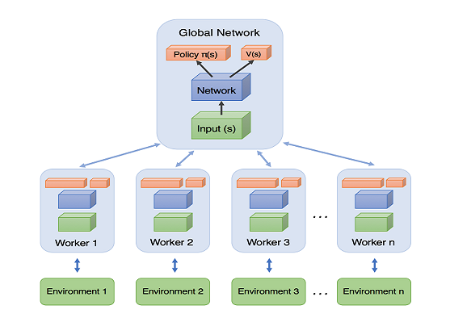
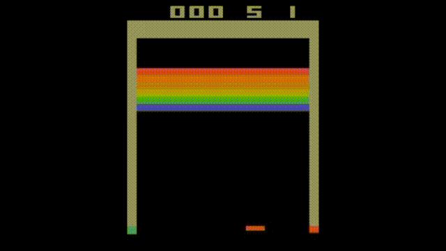
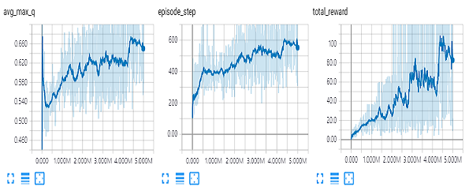

## Asynchronous Actor-Critic Agents in Tensorflow
Tensorflow implementation of [Asynchronous Methods for Deep Reinforcement Learning](https://arxiv.org/abs/1602.01783)

* [Breakout](https://elgoog.im/breakout/) is a game that gets higher score as you move a bar and break bricks
* An agent itself learned how to get a high score by making a path in the breakout environment
* For training, a global agent uses multiple different samples that multi workers get

## Prerequisites
* python 3.6
* tensorflow 1.12
* [gym](https://gym.openai.com/docs/#installation)
* numpy
* skimage

## Result

